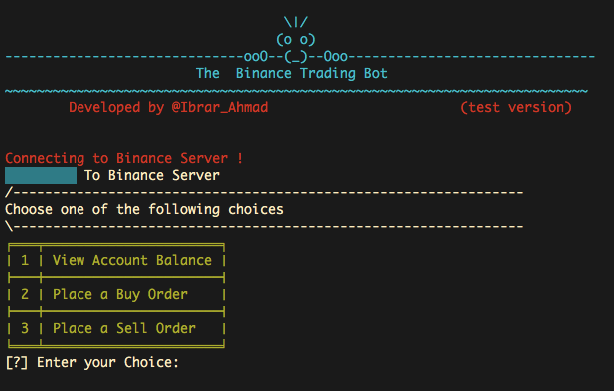

# BinanceAPI
Python based CLI program , with which you can place buy/sell orders using your Binance account API.Just put your Api key and secret key and start placing your orders.List of used dependencies are included in requirement.txt.

